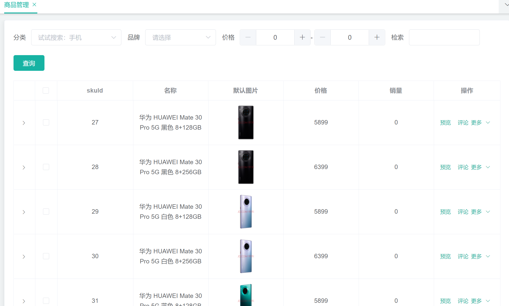

# 基于SpringCloud实现的分布式商城

## 组织结构

```
gulimall
├── gulimall-common -- 工具类及通用代码
├── renren-generator -- 人人开源项目的代码生成器
├── gulimall-auth-server -- 认证中心（社交登录、OAuth2.0）
├── gulimall-cart -- 购物车服务
├── gulimall-coupon -- 优惠卷服务
├── gulimall-gateway -- 统一配置网关
├── gulimall-order -- 订单服务
├── gulimall-product -- 商品服务
├── gulimall-search -- 检索服务
├── gulimall-seckill -- 秒杀服务
├── gulimall-third-party -- 第三方服务（对象存储、短信）
├── gulimall-ware -- 仓储服务
└── gulimall-member -- 会员服务
```

## 技术选型

### 后端技术及版本选择

| 技术               | 说明                     | 版本                                                         |
| ------------------ | ------------------------ | ------------------------------------------------------------ |
| SpringBoot         | 容器+MVC框架             | 2.1.8.RELEASE                                                |
| SpringCloud        | 微服务架构               | Greenwich.SR3                                                |
| SpringCloudAlibaba | 一系列组件               | 2.1.0.RELEASE                                                |
| MyBatis-Plus       | ORM框架                  | 默认                                                         |
| renren-generator   | 人人开源项目的代码生成器 | 下载地址：https://gitee.com/renrenio/renren-generator?_from=gitee_search |
| Elasticsearch      | 搜索引擎                 | 7.4.2                                                        |
| RabbitMQ           | 消息队列                 | latest                                                       |
| Springsession      | 分布式缓存               | 默认                                                         |
| Redisson           | 分布式锁                 | 默认                                                         |
| Docker             | 应用容器引擎             | 默认                                                         |
| OSS                | 对象云存储               | https://github.com/aliyun/aliyun-oss-java-sdk                |

### 前端技术

| 技术      | 说明       | 官网                                                    |
| --------- | ---------- | ------------------------------------------------------- |
| Vue       | 前端框架   | [https://vuejs.org](https://vuejs.org/)                 |
| Element   | 前端UI框架 | [https://element.eleme.io](https://element.eleme.io/)   |
| thymeleaf | 模板引擎   | [https://www.thymeleaf.org](https://www.thymeleaf.org/) |
| node.js   | 服务端的js | https://nodejs.org/en                                   |

## 项目微服务


## 环境搭建

### 开发工具

| 工具         | 说明                |
| ------------ | ------------------- |
| IDEA         | 开发Java程序        |
| RedisDesktop | redis客户端连接工具 |
| SwitchHosts  | 本地host管理        |
| MobaXterm    | Linux远程连接工具   |
| Navicat      | 数据库连接工具      |
| Postman      | API接口调试工具     |
| Jmeter       | 性能压测工具        |
| Typora       | Markdown编辑器      |

### 开发环境

| 工具     | 版本号 |
| :------- | ------ |
| JDK      | 1.8    |
| Mysql    | 5.7    |
| Redis    | Redis  |
| RabbitMQ | 3.8.5  |

## 搭建步骤

### 地址设置

```
192.168.56.10 gulimall.com
192.168.56.10 search.gulimall.com
192.168.56.10 item.gulimall.com
192.168.56.10 auth.gulimall.com
192.168.56.10 cart.gulimall.com
192.168.56.10 order.gulimall.com
192.168.56.10 member.gulimall.com
192.168.56.10 seckill.gulimall.com
```

### Nginx配置

```nginx
server {
    listen       80;
    server_name  gulimall.com *.gulimall.com abtday.natappfree.cc;

    #charset koi8-r;
    #access_log  /var/log/nginx/log/host.access.log  main;

    location /static/ {
        root   /usr/share/nginx/html;
    }

    location /payed/ {
        proxy_set_header Host order.gulimall.com;
        proxy_pass http://gulimall;
    }


    location / {
        proxy_set_header Host $host;
        proxy_pass http://gulimall;
    }

    #error_page  404              /404.html;

    # redirect server error pages to the static page /50x.html
    #
    error_page   500 502 503 504  /50x.html;
    location = /50x.html {
        root   /usr/share/nginx/html;
    }

    # proxy the PHP scripts to Apache listening on 127.0.0.1:80
    #
    #location ~ \.php$ {
    #    proxy_pass   http://127.0.0.1;
    #}

    # pass the PHP scripts to FastCGI server listening on 127.0.0.1:9000
    #
    #location ~ \.php$ {
    #    root           html;
    #    fastcgi_pass   127.0.0.1:9000;
    #    fastcgi_index  index.php;
    #    fastcgi_param  SCRIPT_FILENAME  /scripts$fastcgi_script_name;
    #    include        fastcgi_params;
    #}

    # deny access to .htaccess files, if Apache's document root
    # concurs with nginx's one
    #
    #location ~ /\.ht {
    #    deny  all;
    #}
}
```

## 部分界面

### 后台登录


### 商品管理



### 发布商品


### 商品详情


### 购物车


### 支付


## LICENSE

This repository is released under the Apache 2.0 license as found in the [LICENSE](https://github.com/czczup/URST/blob/main/LICENSE.md) file.
